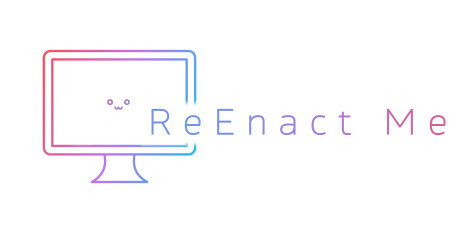

<p align="center">
  
</p>

## ⚡ Варианты использования

1. Онлайн: [](https://replicate.com/xinntao/realesrgan)
1. С помощью Notebook Colab: [](https://colab.research.google.com/drive/1k2Zod6kSHEvraybHl50Lys0LerhyTMCo?usp=sharing) **|** Notebook Colab (**видео**): [](https://colab.research.google.com/drive/1yNl9ORUxxlL4N0keJa2SEPB61imPQd1B?usp=sharing)


## Необходимые версии

- Python >= 3.7
- PyTorch >= 1.7

### Установка

1. Склонируйте репозиторий

    ```bash
    git clone https://github.com/trysiki/ReEnact
    cd ReEnact
    ```

1. Установите необходимые пакеты

    ```bash
    # basicsr - https://github.com/xinntao/BasicSR
    pip install basicsr
    pip install facexlib
    pip install gfpgan
    pip install -r requirements.txt
    python setup.py develop
    ```